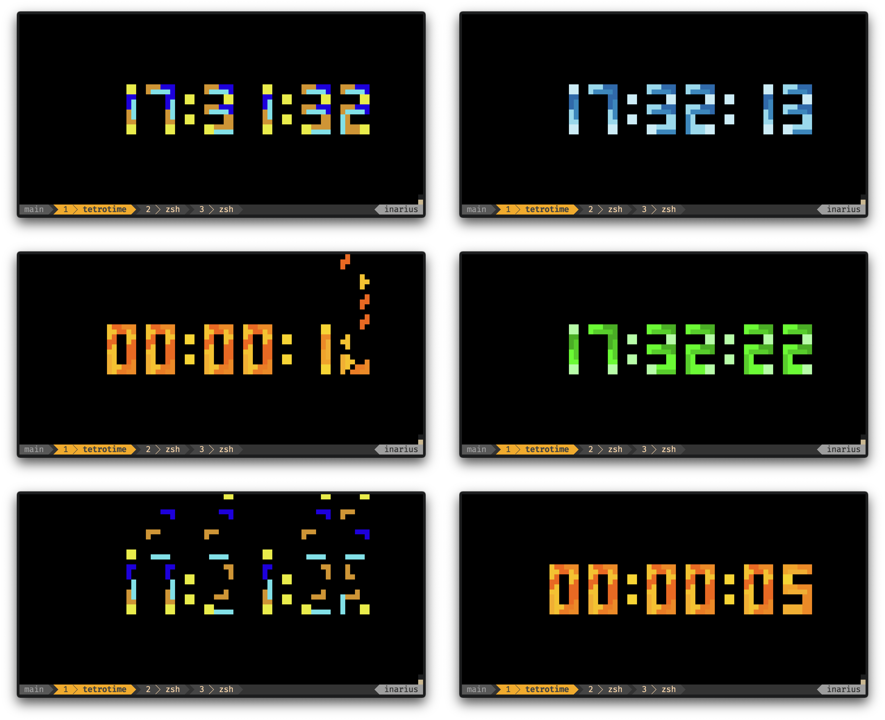

# tetrotime
Terminal Tetromino Clock in Rust - When Tetris Meets Time!

# ⌚Tetro Time 🎮

## Overview

A tetris/tetromino based clock, timer and stopwatch for your **terminal**, which
displays the time using falling tetrominos. The rendering is done using the
[PixelLoop](https://crates.io/crates/pixel_loop) engine. If you are interested
in the development of this and other projects check out my YouTube channel
[MrJakob](https://youtube.com/c/mrjakob), where I live code this and other
projects.



## Install

Use `cargo` to install:

```bash
cargo install tetrotime
```

**Note:** Currently there is no binary release available. If you would be interested in something like this please let me know.

## Usage

Just execute the `tetrotime` command in your terminal and adjust the size of
your terminal accordingly. You may use the commandline arguments to configure
the mode as well as the used colorscheme to your liking:

```
TetroTime - Time meets Tetris!

Usage: tetrotime [OPTIONS]

Options:
  -c, --clock
          Show a clock

  -w, --stopwatch
          Show a stopwatch

  -d, --countdown <DURATION>
          Show a countdown (Duration in HHMMSS or HH:MM:SS)

  -s, --colorscheme <COLORSCHEME>
          Select a specific colorscheme

          [default: original]

          Possible values:
          - original:  Classic Tetris colors with bright, distinct shades
          - grayscale: Different shades of gray for a monochrome look
          - position:  Colors based on the digit position in the time display
          - digit:     Each digit (0-9) gets its own distinct color
          - neon:      Vibrant neon colors inspired by cyberpunk aesthetics
          - pastel:    Soft, muted pastel colors for a gentle appearance
          - ocean:     Shades of blue and turquoise inspired by ocean depths
          - autumn:    Warm fall colors with reds, browns and golden tones
          - christmas: Traditional Christmas theme with reds, greens and gold
          - warm:      Warm spectrum focusing on yellows and oranges
          - matrix:    Digital green shades inspired by The Matrix movie
          - purple:    Rich and deep purple/violet color palette

  -h, --help
          Print help (see a summary with '-h')

```


## Build Instructions

To build the project use `cargo`:

```shell
cargo build --release
```

Once built, run the `target/release/tetrotime` binary to start the clock/timer


